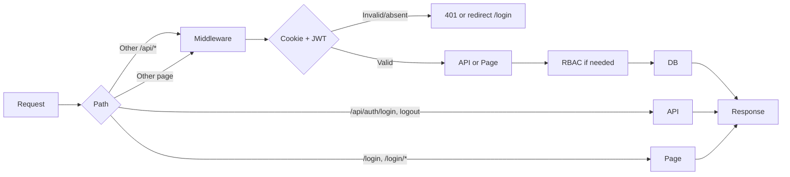

# Architecture

## Databases / collections

The app uses **MongoDB**. Collections:

| Collection     | Purpose                                      |
|----------------|----------------------------------------------|
| `doctors`      | Staff accounts (admin, doctor, nurse)         |
| `patients`     | Patient records                              |
| `visits`       | Visit records (per patient)                  |
| `appointments` | Daily queue (date, order, status)            |

## Model structures

### Doctor

- `email` (String, required, unique)
- `passwordHash` (String, required)
- `role` (String, enum: `admin` | `doctor` | `nurse`, default `doctor`)
- `name` (String, default `''`)

### Patient

- `name` (String, required)
- `age` (Number, required)
- `gender` (String, required)
- `phone`, `address`, `location` (String, default `''`)
- `temperament` (String, optional, from fixed options)
- `createdAt`, `updatedAt` (timestamps)

Index: text index on `name`, `phone`, `location` for search.

### Visit

- `patientId` (ObjectId, ref Patient, required)
- `date` (Date, required)
- `symptoms`, `diagnosis`, `notes` (String, default `''`)
- `medicinesParagraph` (String, optional) – free-text prescription
- `medicines` (Array of `{ name, dosage, duration }`)

Index: `{ patientId: 1, date: -1 }`.

### Appointment

- `patientId` (ObjectId, ref Patient, required)
- `date` (Date, required) – calendar day (e.g. start-of-day)
- `order` (Number, default 0) – position in queue
- `status` (`'queued'` | `'visited'`, default `'queued'`)
- `addedAt` (Date, default now)
- `visitedAt` (Date, optional)
- `addedBy` (ObjectId, ref Doctor, optional)

Index: `{ date: 1, order: 1 }`.

---

## Current architecture

- **Framework**: Next.js with App Router.
- **Styling**: Tailwind CSS; accent (e.g. soft blue / emerald) and responsive layout.
- **Database**: MongoDB via Mongoose; connection in `lib/db.ts`.

### Request flow

### Middleware

- **File**: `middleware.ts`
- **Behaviour**:
  - `/api/auth/login`, `/api/auth/logout`: no auth.
  - All other `/api/*`: require valid JWT in cookie; else 401.
  - `/login`, `/login/forgot`: if already logged in, redirect to `/dashboard`.
  - All other pages: require valid JWT; else redirect to `/login?from=...`. Invalid/expired token clears cookie and redirects to login.

### Auth flow

- **JWT**: Issued with `jose` (HS256), 8-hour expiry. Payload: `sub` (doctor id), `email`, `role`.
- **Cookie**: `clinic_token`, httpOnly, sameSite=lax, secure in production.
- **Login**: POST `/api/auth/login` with `email`/`password`; bcrypt compare; set cookie and return success.
- **Logout**: POST `/api/auth/logout` clears cookie.
- **Me**: GET `/api/auth/me` returns current user (from cookie JWT).

### Role checks (RBAC)

- **File**: `lib/rbac.ts`
- **Helpers**: `isAdmin`, `canEditPatients`, `canEditVisits`, `canAccessStaff`, `canManageQueue`, `canAddToQueue`.
- **Queue**: Admin/doctor can reorder, mark visited, delete. Admin/doctor/nurse can add to queue; nurse cannot reorder or mark visited.

### API layout

- `app/api/auth/` – login, logout, me
- `app/api/patients/` – CRUD and list (with search)
- `app/api/patients/[id]/` – get, put, delete
- `app/api/visits/` – list (by patientId), POST
- `app/api/visits/[id]/` – get, put, delete
- `app/api/staff/` – list, POST (admin only)
- `app/api/staff/[id]/` – get, put, delete (admin only)
- `app/api/appointments/` – GET `?date=YYYY-MM-DD`, POST
- `app/api/appointments/[id]/` – PUT (reorder / mark visited), DELETE

Pages (main): `/`, `/login`, `/dashboard`, `/patients`, `/patients/[id]`, `/staff`.
